# 數據流監控頁面總覽

> **版本**: 1.0.0  
> **建立日期**: 2026-08-16  
> **狀態**: Active / Authoritative  
> **維護者**: HQ  
> **讀取策略**: On-Demand

本文件定義系統中所有數據流監控頁面的訪問方式、部署位置與功能說明。

---

## 📊 監控頁面清單

### 1. MQTT Engineering Terminal (MQTT 工程終端)

**主要 MQTT 數據流監控工具，終端機風格介面**

| 項目 | 內容 |
|------|------|
| **訪問 URL** | `https://mqtt.tg25.win/` |
| **VPS** | infra (141.148.165.50) |
| **部署路徑** | `/var/www/mqtt/` |
| **本地原始檔** | `PROJECT/Infra/mqtt/scripts/mqtt-terminal.html` |
| **Nginx 配置** | `location / { root /var/www/mqtt; index index.html; }` |
| **負責 Agent** | Ina (Infra) |

**功能特色**：
- ✅ 終端機風格 UI（黑底綠字、JetBrains Mono 字體）
- ✅ 即時訂閱 MQTT 原始數據流 (`device/#`)
- ✅ WebSocket 連線到 `wss://mqtt.tg25.win/mqtt-ws/`
- ✅ 分類統計：credit_in, credit_out, command, auth, status, alarm
- ✅ 設備列表：即時顯示在線/離線狀態
- ✅ 命令輸入：手動發布 MQTT 訊息（`pub`, `sub`, `unsub`）
- ✅ 過濾功能：按分類或設備 ID/MAC 過濾
- ✅ 歷史命令：支援 ↑↓ 鍵瀏覽命令歷史

**連線資訊**：
```javascript
Broker:   wss://mqtt.tg25.win/mqtt-ws/
User:     backend_user
Password: backend_mqtt_2024
Subscribe: device/#
```

**使用場景**：
1. 🔍 調試 MQTT 通訊：查看設備是否正常上報數據
2. 📊 監控數據流：確認 credit_in/out 是否正確
3. 🛠️ 發送測試命令：手動測試 assign_credit 等指令
4. 🚨 故障排查：在 /realtime 有問題時，回到源頭檢查 MQTT 層

**數據流位置**：
```
採集卡 → MQTT Broker → mqtt-terminal.html (原始數據)
                      → Python Listener → Infra → Owner → /realtime
```

---

### 2. Owner Realtime Dashboard (商戶即時監控)

**商戶後台的設備即時監控頁面**

| 項目 | 內容 |
|------|------|
| **訪問 URL** | `https://iot.tg25.win/realtime` |
| **VPS** | yd174 (129.153.116.174) |
| **部署路徑** | `/www/wwwroot/iot.tg25.win/` |
| **本地原始檔** | `PROJECT/Owner/resources/views/iot/realtime.blade.php` |
| **路由定義** | `Route::get('realtime', fn() => view('iot.realtime'))` |
| **負責 Agent** | Sophie (Owner) |

**功能特色**：
- ✅ 設備卡片式即時監控
- ✅ Laravel Reverb WebSocket 推送 (`channel: realtime`, `event: .device.updated`)
- ✅ 初始數據從 DB 載入 (`GET /api/v9/realtime/devices`)
- ✅ 顯示：設備名稱、chip_id、場地、機型、在線狀態、今日入金、出金、洗分

**技術架構**：
- Frontend: Alpine.js + Laravel Echo
- Backend: Laravel Reverb (Port 6009)
- 初始 API: `Api\V9\RealtimeController@getDevices`
- 推送事件: `DeviceUpdated implements ShouldBroadcast`

**數據流位置**：
```
Infra → POST /api/internal/broadcast/device-update
     → InternalBroadcastController@deviceUpdate
     → DeviceUpdated Event
     → Reverb (channel: realtime)
     → Frontend realtime.blade.php
```

**規範文檔**：`REALTIME_MONITORING_PAGE_FLOW.md`

---

### 3. Member Engineering Kiosk Dashboard (兌幣機工程面板)

**兌幣機信號流監控與工程測試面板**

| 項目 | 內容 |
|------|------|
| **訪問 URL** | `https://win.tg25.win/engineering/kiosk` |
| **VPS** | yd47 (129.146.103.177) |
| **部署路徑** | `/var/www/waw-wallet/` |
| **本地原始檔** | `PROJECT/Member/resources/views/engineering/kiosk.blade.php` |
| **路由定義** | `Route::get('/engineering/kiosk', [EngineeringController::class, 'dashboard'])` |
| **負責 Agent** | Mina (Member) |

**功能特色**：
- ✅ Signal Flow Monitor (信號流監控節點)
- ✅ 設備綁定選擇器 (node_id + ESP32 MAC + Screen MAC)
- ✅ 即時事件日誌 (Terminal 風格)
- ✅ WebSocket 推送 (Pusher/Echo)
- ✅ Kiosk 狀態監控 (IDLE, BUSY, ERROR)
- ✅ 會員綁定狀態追蹤

**使用場景**：
1. 🧪 測試兌幣機工作流程
2. 🔗 查看設備綁定狀態
3. 📡 監控信號流節點狀態
4. 🐛 調試 Kiosk 事件流

**規範文檔**：`KIOSK_ENGINEERING_DASHBOARD.md`

---

### 4. Hardware Distribution Center (韌體下載中心)

**ESP32/iHub 韌體版本管理與 OTA 下載服務**

| 項目 | 內容 |
|------|------|
| **訪問 URL** | `https://hware.tg25.win/` |
| **VPS** | infra (141.148.165.50) |
| **部署路徑** | `/var/www/hware.tg25.win/` |
| **本地原始檔** | `PROJECT/Infra/hardware/web/index.html` |
| **負責 Agent** | Fio (IOTkiosk_v0) / Coli (IOTwawS3) / Ina (Infra) |

**功能特色**：
- ✅ 韌體版本列表與 CHANGELOG
- ✅ `.bin` 檔案下載 (`/firmware/`)
- ✅ 版本查詢 API (`/api/version.json`)
- ✅ 現代化 UI (Tailwind CSS + 漸變背景)

**Nginx 端點**：
- `/firmware/` — 韌體下載 (autoindex on)
- `/api/version.json` — 版本資訊 API
- `/web/` — 網頁 (CHANGELOG 等)

---

### 5. BLE Control & Installation (已封存)

| 項目 | 內容 |
|------|------|
| **可能 URL** | `https://ble.tg25.win/` (需確認) |
| **狀態** | ⚠️ Legacy / Archived (legacy_202608) |
| **本地原始檔** | `PROJECT/Infra/archive/legacy_202608/web/ble-*` |
| **功能** | BLE 設備控制與安裝工具 |

---

## 🔄 完整數據流架構圖

```mermaid
graph TB
    A[採集卡/設備] -->|MQTT| B[mqtt.tg25.win<br/>Mosquitto Broker]
    B -->|WebSocket| C[mqtt-terminal.html<br/>🖥️ 終端監控]
    B -->|Python Listener| D[Infra waw-iot]
    D -->|Internal API| E[Owner Backend]
    E -->|Reverb WS| F[iot.tg25.win/realtime<br/>📊 商戶監控]
    
    B -->|MQTT| G[iHub/Kiosk 設備]
    G -->|API| H[Member Backend]
    H -->|Pusher/Echo| I[win.tg25.win/engineering/kiosk<br/>🛡️ 工程面板]
    
    style C fill:#0d0f14,stroke:#58a6ff
    style F fill:#f9f,stroke:#333
    style I fill:#1f2937,stroke:#10b981
```



---

## 🎯 監控頁面選擇指南

| 需求場景 | 推薦頁面 | 理由 |
|---------|---------|------|
| 查看原始 MQTT 數據流 | mqtt-terminal.html | 最底層，未經處理的原始數據 |
| 商戶查看設備狀態 | iot.tg25.win/realtime | 適合營運端，設備卡片式呈現 |
| 調試兌幣機流程 | win.tg25.win/engineering/kiosk | 專為 Kiosk 工程測試設計 |
| 查看韌體版本 | hware.tg25.win | 韌體管理與下載 |
| MQTT 通訊問題排查 | mqtt-terminal.html | 可以看到完整的 topic 和 payload |
| Reverb 推送問題排查 | iot.tg25.win/realtime | 確認前端是否收到 WebSocket 事件 |

---

## 📚 相關文檔

### 強關聯
- `REALTIME_MONITORING_PAGE_FLOW.md` — /realtime 頁面流程規範
- `KIOSK_ENGINEERING_DASHBOARD.md` — Kiosk 工程面板設計
- `MQTT_TOPIC_STANDARD.md` — MQTT 主題命名規範
- `INFRASTRUCTURE_REFERENCE.md` — VPS 與域名對照

### 中關聯
- `SYSTEM_ENTRYPOINTS_AND_DOMAINS.md` — 系統入口與域名分工
- `V9_SYSTEM_SPLITTING_DESIGN.md` — 人與物拆分架構
- `DEVICE_CONNECTION_STATUS_FLOW.md` — 設備連線狀態流程

---

## 🔧 維護與部署

### MQTT Terminal 部署

```bash
# 上傳到 VPS
scp /Users/ilawusong/Documents/WaW/PROJECT/Infra/mqtt/scripts/mqtt-terminal.html \
    infra:/var/www/mqtt/index.html

# 確認 Nginx 配置
ssh infra "sudo cat /etc/nginx/sites-enabled/mqtt.tg25.win | grep 'root'"

# 重啟 Nginx
ssh infra "sudo systemctl reload nginx"
```

### Owner Realtime 部署

參考 `HQ_DEPLOYMENT_SOP.md` 中的 Owner 部署流程。

### Member Engineering 部署

參考 `MEMBER_DEPLOYMENT_GUIDE.md` 中的 Member 部署流程。

---

## 📝 變更歷史

| 日期 | 版本 | 修改者 | 變更內容 |
|------|------|--------|---------|
| 2026-08-16 | 1.0.0 | HQ | 初始版本，整理所有監控頁面資訊 |

