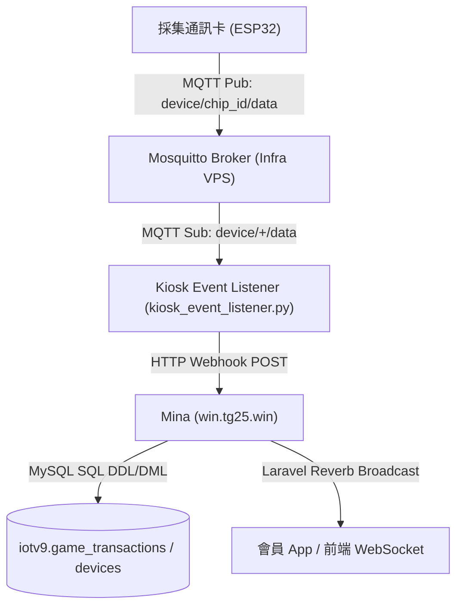

# wawMember 設備數據採集與上報鏈 (Uplink Telemetry Flow) 規格與實作分析

**Agent**: Ina (Infra Master)
**專案**: Infra (api.tg25.win / `tg25-infra`)
**最後更新**: 2026-05-30

本文件詳細記錄 WAW IoT 系統中，**採集通訊卡（ESP32）投幣信號上傳與結算** 的完整數據鏈路。涵蓋從實體脈衝採集、MQTT 發送、Infra 事件監聽轉發、Member 後端資料庫寫入到前端 WebSocket 廣播的設計與實作細節。

---

## 1. 鏈路拓樸總覽 (Uplink Topology)

當外部發生「採集通訊卡」投幣訊號觸發時，數據流動如下：



---

## 2. 邊緣採集與 MQTT 上報規格 (ESP32 → MQTT)

當設備端投幣或開分訊號變動時，採集通訊卡（ESP32）負責將計數數據提交至 MQTT Broker。

### 📡 通訊協定細節
- **MQTT 主題 (Topic)**: `device/{chip_id}/data`
  - `chip_id`: ESP32 硬體 MAC 位址（去冒號格式，小寫，例：`e072a1f73a78`）。
- **QoS (Quality of Service)**: `1`（至少送達一次，確保投幣數據不遺漏）。
- **Payload 格式 (JSON)**:
```json
{
  "type": "credit_out",
  "amount": 1025
}
```

### 📋 欄位定義：
- `type`: 固定字串為 `"credit_out"`，代表投幣/出金事件。
- `amount`: 設備累計投幣數（「里程表」模式的累積值，並非單次增加的 delta。這是為了防止網路中斷或遺漏封包時，系統能自動對齊最高累積數）。

---

## 3. 中繼轉發服務規格 (MQTT → Webhook)

Infra 的背景中繼服務 `kiosk_event_listener.py` 負責訂閱 MQTT 訊息，進行設備與站點（`node_id`）的映射快取管理，並透過高效的安全 Webhook 將數據透傳至會員端（Mina）。

### ⚙️ 中繼轉發處理程序 (`handle_device_data`)
1. **快取查詢**：Listener 連接 `iotv9` MySQL 庫以 10 分鐘自動載入一次 `chip_id <-> node_id` 映射關係。
2. **Redis 即時更新**：Listener 會同步更新 Redis `last_credit_out:{chip_id}`，儲存最新累計額。
3. **Webhook 轉發**：組合專用 Payload 後打向會員系統 (Mina) 的 Webhook。

### 🔗 Webhook 規格 (Infra → Mina)
- **Endpoint**: `POST https://win.tg25.win/internal/device/credit-out`
- **Header 安全密鑰**:
  ```http
  X-Internal-Key: v9-internal-key-2026
  Content-Type: application/json
  User-Agent: WAW-Infra-Listener/1.0
  ```
- **Payload 結構**:
```json
{
  "chip_id": "e072a1f73a78",
  "cumulative_amount": 1025
}
```

### 🔴 異常流程與容錯處理
1. **認證失敗**: 若 `X-Internal-Key` 錯誤，Mina 回傳 `401 Unauthorized`，Listener 記錄 `Member Webhook Error [401]` 日誌。
2. **無效設備 (No node_id)**: 若快取中找不到 `chip_id` 的對應 `node_id`，為避免無效請求打爆 Webhook，Listener 會輸出 `Event discarded: No node_id` 並安靜丟棄。
3. **HTTP 傳輸超時**: Webhook `timeout` 設為 `5` 秒，避免 Mina 端資料庫 Metadata lock 堵塞時，把整個 MQTT Listener 主迴圈卡死。

---

## 4. 會員後端與資料庫寫入 (Mina → MySQL)

會員端（Mina）在 `/internal/device/credit-out` 接收到資料後，會處理核心的點數變更與累計統計。

- **資料庫**: `iotv9` MySQL (透過 3308 隧道安全連接)
- **變更資料表與欄位**:
  - `game_transactions` 表：新增點數交易紀錄
  - `devices` 表：更新 `lifetime_credit_out` = `cumulative_amount`（或進行防爆大點數的冷啟動基準校驗），並更新 `last_seen_at` = `NOW()`。

---

## 5. WebSocket 即時廣播規格 (Mina → 前端)

當資料庫成功寫入後，會員後端會發送 WebSocket 廣播通知前端網頁與 APP。

### 📡 廣播協議細節
- **廣播服務**: Laravel Reverb (WebSocket)
- **Channel 頻道**: `device.{chip_id}`
- **Event 事件名**: `.CreditOutDetected`
- **Payload 結構**:
```json
{
  "cumulative_amount": 1025
}
```

前端收到事件後，會將數據展示給用戶，並更新卡片的即時計數器，完成整條「採集 ➔ 上報 ➔ 儲存 ➔ 呈現」的即時數據流閉環！
